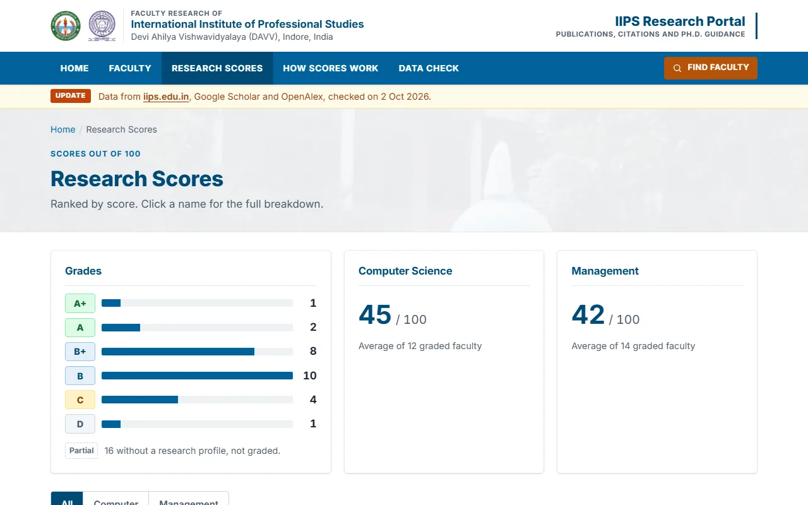

# IIPS Research Publication & Faculty Performance Information System

Faculty profiles, publications and research scores for the International Institute of Professional Studies (IIPS), DAVV Indore. A static site: one JSON snapshot, no database, every page prerendered.

**Live:** https://arpanpatra111.github.io/IIPS-Research/ (also at https://iips-research.vercel.app)


|                                               |                                             |
| --------------------------------------------- | ------------------------------------------- |
|  |  |

## Pages

- `/` — portal summary and recent publications
- `/faculty` — faculty directory
- `/faculty/<slug>` — a faculty profile and publication list
- `/scores` — research score rankings
- `/method` — score calculation and data limitations
- `/data-check` — source profile matches and their evidence

## Run locally

### Prerequisites

- Git
- Node.js 22.18 or newer (`node --version` to check)
- pnpm 10.11 or newer. If you only have Node.js, enable it via Corepack (ships with Node.js):
  ```bash
  corepack enable
  pnpm --version
  ```
- Works on Windows, macOS and Linux. No environment variables or `.env` file are needed — the site runs entirely from the checked-in data snapshot.

> Use pnpm, not npm or yarn. The repo enforces the package manager and Node version (`packageManager` field plus `engine-strict=true`), so other package managers fail fast instead of installing a broken tree.

```bash
git clone https://github.com/ARPANPATRA111/IIPS-Research.git
cd IIPS-Research
pnpm install
pnpm dev          # http://localhost:5173
```

The development server uses the checked-in data snapshot; it does not fetch records from IIPS, Google Scholar, or OpenAlex.

Production build:

```bash
pnpm build
pnpm preview      # http://localhost:4190
```

Checks:

```bash
pnpm check                       # Svelte and TypeScript checks
pnpm lint                        # Prettier and ESLint
pnpm test                        # unit tests (Vitest)
pnpm exec playwright install chromium   # once, downloads the browser for e2e tests
pnpm test:e2e                    # end to end tests, incl. accessibility checks
```

On a fresh Linux machine the browser install may need system dependencies: run
`pnpm exec playwright install --with-deps chromium` (requires sudo) instead.

### Troubleshooting

- `pnpm: command not found` — run `corepack enable`, then open a new terminal and retry.
- `EBADENGINE / Unsupported engine` on install — your Node.js is older than 22.18. Install the latest LTS from https://nodejs.org and retry.
- Port already in use (`5173` for dev, `4190` for preview) — stop the other process, or run `pnpm dev --port 5174` / `pnpm preview --port 4192`.
- e2e fails with `Executable doesn't exist` — you skipped the one-time `pnpm exec playwright install chromium` step above.
- `pnpm data:*` needs network access (and Google Scholar may rate-limit automated requests — wait and retry). Plain `pnpm dev` / `pnpm build` never touch the network; they use the checked-in snapshot.

## Deploy

Every route is prerendered, so `pnpm build` produces plain HTML, CSS and JS in `build/`, including a `404.html` that static hosts serve for unknown addresses. The site is live on two hosts, both deployed automatically on every push to `main`:

- GitHub Pages: https://arpanpatra111.github.io/IIPS-Research/
- Vercel: https://iips-research.vercel.app

### GitHub Pages

[`.github/workflows/pages.yml`](.github/workflows/pages.yml) builds with `BASE_PATH=/IIPS-Research` (Pages serves a project site under `/<repo>`) and publishes `build/`. In the repository settings, **Pages → Source** must be set to **GitHub Actions**. To redeploy without a push, run the workflow from the **Actions** tab.

To build the Pages version locally:

```bash
BASE_PATH=/IIPS-Research pnpm build
```

(In Git Bash on Windows, prefix it with `MSYS_NO_PATHCONV=1` so the path is not rewritten.)

### Vercel

The project `iips-research` is linked to this repository, and [`vercel.json`](vercel.json) tells Vercel to build with pnpm and serve `build/` as plain static files. To deploy from your machine instead:

```bash
vercel login
vercel link --yes --project iips-research   # first time only
vercel deploy --prod
```

Other static hosts (Netlify, nginx, …) work the same way: run `pnpm build` and serve `build/`, with `BASE_PATH` set if the site lives under a subpath.

## Data

All routes are prerendered from [`src/lib/data/faculty.json`](src/lib/data/faculty.json), with scoring rules in [`src/lib/data/score-rules.json`](src/lib/data/score-rules.json). The snapshot metadata records its update date. The deployed site does not query a database or external APIs, so its data changes only when the JSON is regenerated and the site is rebuilt and redeployed.

The snapshot is built from raw fetches checked in under [`scripts/data/out/`](scripts/data/out) (`iips.json`, `scholar.json`, `openalex.json`). To rebuild `faculty.json` offline from those snapshots, without network access:

```bash
pnpm data:build
```

For a full refresh from the live sources (needs network access; Google Scholar can rate-limit or block automated requests, so a refresh may need to be retried later), run the pipeline in order from the repository root:

```bash
pnpm data:iips       # faculty profiles and photos from https://iips.edu.in
pnpm data:scholar    # Google Scholar profiles and publications
pnpm data:openalex   # OpenAlex authors and works (cross-check)
pnpm data:build      # merge, clean and write src/lib/data/faculty.json
# or: pnpm data      # all four steps
```

Responses are cached under `.cache/scrape`, so a rerun never hits a site twice — delete that folder (or one file in it) to refetch. `scripts/data/hints.json` adds Scholar profile ids found by hand, `scripts/data/overrides.json` pins or rejects a profile, and `scripts/data/exclusions.json` drops individual papers with a reason. `scripts/data/out/faculty-links.csv` lists one row per person to tick off by hand in a spreadsheet.

Some faculty do not have a matched Google Scholar or OpenAlex profile in the current snapshot. Those profiles fall back to publication entries from the IIPS website, which do not provide citation metrics. The **Data Check** and **How Scores Work** pages describe profile matches and scoring limitations.

## Project layout

```text
src/lib/data        faculty.json (built snapshot), score-rules.json
src/lib/domain      entities, scoring policies (pure TypeScript)
src/lib/server      Portal: loads the snapshot for the pages
src/lib/components  cards, score bars, charts
src/routes          pages for the portal, faculty, scores, method, data-check
scripts/data        fetch + merge pipeline (iips, scholar, openalex, build)
scripts             screenshots.ts (regenerates docs/screens)
tests               unit (Vitest) and end to end (Playwright)
static/faculty      faculty portraits
static/brand        IIPS/DAVV logos and campus photo
```

## Limits

Data is a point-in-time snapshot, not live. Scholar matching is evidence-scored but should be hand-checked (see Data Check). The score weights are a local index for 2026, not an official API/UGC calculation — confirm the rules with the university before real use.
