<!-- cover -->

# IIPS Research Publication & Faculty Performance Information System

**OOAD Lab (IC912B) · MCA, IIPS DAVV Indore** · Project report, short format. The PDF version is [OOAD-Report.pdf](OOAD-Report.pdf) (rebuild with `node docs/ooad/build-pdf.ts`).

<!-- /cover -->

## 0. At a Glance

> **One line:** a public website that collects every IIPS faculty member's publications from three sources, removes wrong papers, and gives each person a transparent research score out of 100.

| What           | Where                                                                                            |
| -------------- | ------------------------------------------------------------------------------------------------ |
| Live prototype | [arpanpatra111.github.io/IIPS-Research](https://arpanpatra111.github.io/IIPS-Research/)          |
| Mirror         | [iips-research.vercel.app](https://iips-research.vercel.app)                                     |
| Source code    | [github.com/ARPANPATRA111/IIPS-Research](https://github.com/ARPANPATRA111/IIPS-Research)         |
| Data snapshot  | 2 Oct 2026 · 42 faculty · 709 publications · 3,782 citations · 22 Ph.D. awarded                  |
| Stack          | SvelteKit 2 + Svelte 5, TypeScript, static prerender, Playwright + Vitest, GitHub Pages + Vercel |

**Lab manual checklist** (every task from the manual, in its order)

| #   | Lab task                                 | Status                                 | Section                                                                |
| --- | ---------------------------------------- | -------------------------------------- | ---------------------------------------------------------------------- |
| 1   | Problem Statement                        | Done           | [§1](#1-problem-statement)                                             |
| 2   | Stakeholder Analysis                     | Done           | [§2](#2-stakeholder-analysis)                                          |
| 3   | Software Requirement Specification (SRS) | Done           | [§3](#3-software-requirement-specification-srs)                        |
| 4   | Functional & Non-functional Requirements | Done           | [§4](#4-functional-requirements), [§5](#5-non-functional-requirements) |
| 5   | 10 UML diagrams (use case … deployment)  | Done           | [§6](#6-uml-diagrams)                                                  |
| 6   | Database Design (ER + relational schema) | Logical only | [§7](#7-database-design)                                               |
| 7   | UI Mockups / Wireframes                  | Mockups only | [§8](#8-ui-mockups--wireframes)                                        |
| 8   | Layered Architecture                     | Done           | [§9](#9-layered-architecture)                                          |
| 9   | Design Patterns                          | Done           | [§10](#10-design-patterns)                                             |
| 10  | Software Design Document (SDD)           | Done           | [§11](#11-software-design-document-sdd)                                |
| 11  | Prototype · GitHub · Documentation       | Done           | [§12](#12-prototype-github--documentation)                             |
| 12  | What was not possible, and why           | Listed       | [§13](#13-not-done-and-why)                                            |
| 13  | Final Presentation                       | This document  | —                                                                      |

## 1. Problem Statement

IIPS has 42 faculty across Computer Science and Management, but their research record is **scattered and unverified**:

- The IIPS website lists papers as free text, with no citation counts.
- Google Scholar and OpenAlex have citation data, but **only for some faculty**, and they often attach a **namesake's papers** to the wrong person.
- There is **no single place** to compare research output, and no score whose rules anyone can check.

**Goal:** build a system that gathers publication data from the IIPS website, Google Scholar and OpenAlex, cleans it, and shows per-faculty profiles, publications, citations, Ph.D. guidance and a **transparent Research Index (0–100)** with rankings. All rules and data matches stay visible.

## 2. Stakeholder Analysis

| Stakeholder                                        | Interest / need                                          | How the system serves them                                            | Influence |
| -------------------------------------------------- | -------------------------------------------------------- | --------------------------------------------------------------------- | --------- |
| **Faculty members**                                | Accurate, complete record; fair score                    | Profile page, evidence for every match, papers set aside with reasons | High      |
| **Director / IQAC / admin**                        | NAAC / NBA style research summaries, rankings            | Rankings table, department filter, totals on home                     | High      |
| **Students & research scholars**                   | Find a guide by research area                            | Directory search by name or area, Ph.D. lists                         | Medium    |
| **External visitors / recruiters / collaborators** | Quick view of IIPS research strength                     | Public site, links out to Scholar / OpenAlex / DOI                    | Low       |
| **Maintainer (developer)**                         | Easy refresh, low cost, no server to run                 | Scripted data pipeline, static hosting, tests                         | High      |
| **Data sources**                                   | iips.edu.in, Google Scholar, OpenAlex (external systems) | Read only, cached, rate-limit aware                                   | —         |

## 3. Software Requirement Specification (SRS)

| Item            | Summary                                                                                                                                                                            |
| --------------- | ---------------------------------------------------------------------------------------------------------------------------------------------------------------------------------- |
| **Purpose**     | One public, read-only portal for IIPS faculty research, with a score whose rules are open.                                                                                         |
| **Scope**       | In: profiles, publications, citations, h / i10 index, Ph.D. guidance, Research Index, rankings, data-match review. Out: logins, data entry forms, official UGC API / PBAS scoring. |
| **Users**       | Visitor (student, faculty, admin, public): read only. Maintainer: runs the data pipeline and deploys.                                                                              |
| **Environment** | Any modern browser, desktop or mobile. Build: Node.js ≥ 22.18, pnpm 10. Hosting: any static host.                                                                                  |
| **Constraints** | No paid services, no database server. Google Scholar has no public API and rate-limits scraping.                                                                                   |
| **Assumptions** | Public profile data may be shown. A data snapshot (not live data) is acceptable.                                                                                                   |
| **Interfaces**  | HTTP GET to iips.edu.in, scholar.google.com, api.openalex.org (pipeline only). The site itself makes no API calls.                                                                 |

## 4. Functional Requirements

| ID    | The system shall …                                                                                                          | Page                  |
| ----- | --------------------------------------------------------------------------------------------------------------------------- | --------------------- |
| FR-1  | Show portal totals (faculty, publications, citations, patents, Ph.D.), top scores, recent papers, top research areas        | `/`                   |
| FR-2  | List all faculty as cards                                                                                                   | `/faculty`            |
| FR-3  | Search faculty by name, designation or research area; filter by department; sort by IIPS order, surname, score or citations | `/faculty`            |
| FR-4  | Show a profile: details, photo, links, Research Index, rank, percentile, radar vs IIPS median                               | `/faculty/<slug>`     |
| FR-5  | List a person's counted publications, filterable by type, plus the papers set aside with the reason                         | `/faculty/<slug>`     |
| FR-6  | Show citations per year, Ph.D. scholars, projects, memberships, responsibilities                                            | `/faculty/<slug>`     |
| FR-7  | Rank all graded faculty; filter the ranking by department                                                                   | `/scores`             |
| FR-8  | Explain the scoring: pillars, weights, curve, grades, what is not counted                                                   | `/method`             |
| FR-9  | Show every source-profile match with its evidence and confidence; filter to weak or missing ones                            | `/data-check`         |
| FR-10 | Fetch, match and clean data from IIPS, Google Scholar and OpenAlex into one JSON snapshot                                   | `pnpm data`           |
| FR-11 | Let the maintainer pin / reject a profile and exclude a paper with a reason                                                 | `scripts/data/*.json` |
| FR-12 | Give partial records (no research profile) no grade and say so                                                              | all pages             |

## 5. Non-functional Requirements

| ID     | Quality            | Requirement and how it is met                                                          |
| ------ | ------------------ | -------------------------------------------------------------------------------------- |
| NFR-1  | Performance        | Every page is prerendered HTML. No server work and no API calls when a page is opened. |
| NFR-2  | Availability       | Deployed to two hosts (GitHub Pages + Vercel) on every push to `main`.                 |
| NFR-3  | Accessibility      | WCAG AA colour contrast; automated axe checks on every page in the e2e tests.          |
| NFR-4  | Responsiveness     | Works from 390 px phones to desktops (mobile e2e test).                                |
| NFR-5  | Transparency       | Score rules in one JSON file and on `/method`; every match shows its evidence.         |
| NFR-6  | Data accuracy      | Six cleaning rules drop namesake, duplicate and unconfirmed papers before scoring.     |
| NFR-7  | Maintainability    | Strict TypeScript, ESLint + Prettier, domain logic kept apart from pages.              |
| NFR-8  | Testability        | 50 unit tests (scoring, cleaning, data) + 28 end-to-end tests, all passing.            |
| NFR-9  | Portability        | Plain static files; runs on Windows, macOS, Linux; any static host.                    |
| NFR-10 | Security & privacy | No backend, no logins, no secrets. Only public profile data is shown.                  |
| NFR-11 | Cost               | ₹0: free hosting, free data sources.                                                   |

## 6. UML Diagrams

> Drawn in Mermaid so they live next to the code and render on GitHub. Mermaid has no native use-case, object, communication, package, component or deployment notation, so those use flowchart shapes that follow the UML layout.

### 6.1 Use Case Diagram

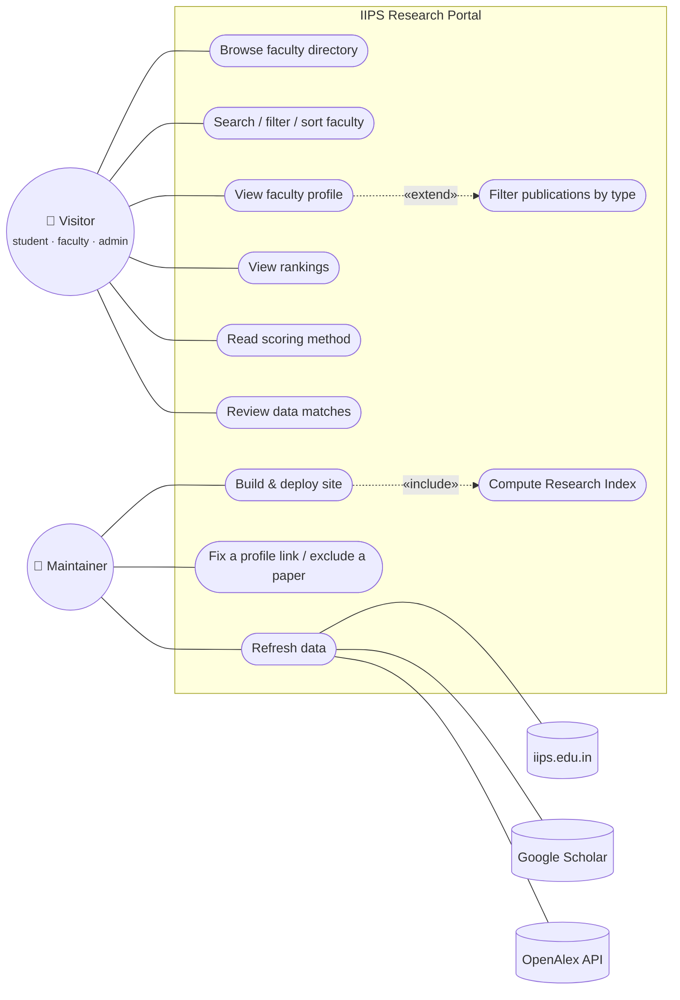

**Actors:** _Visitor_ generalises student, faculty and admin (all read only). _Maintainer_ runs the pipeline. The three data sources are secondary (system) actors.

### 6.2 Activity Diagram — data refresh and publish

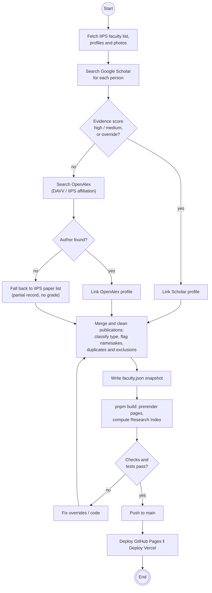

### 6.3 Class Diagram — domain and service layer

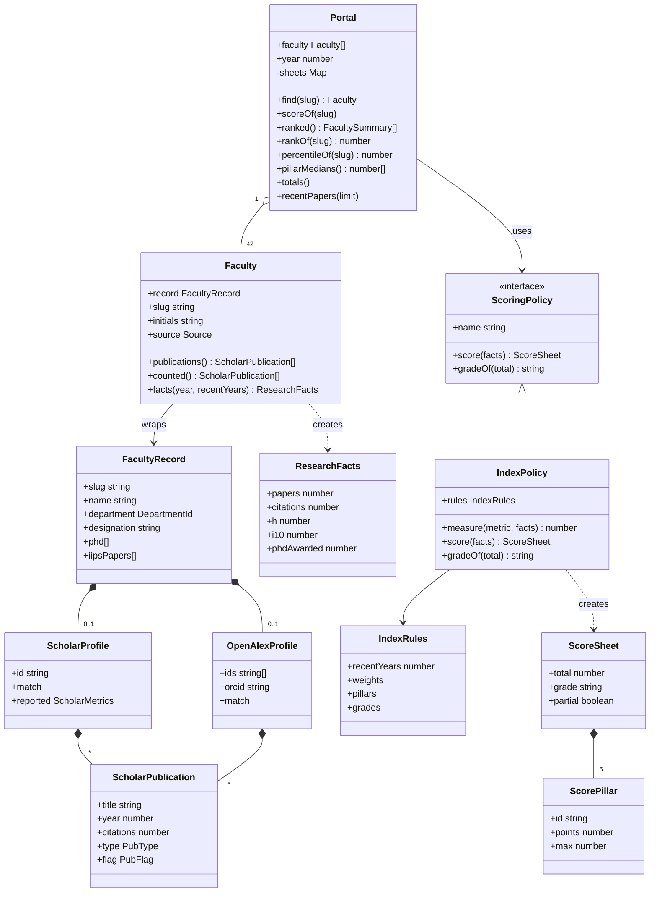

### 6.4 Object Diagram — one real profile at build time

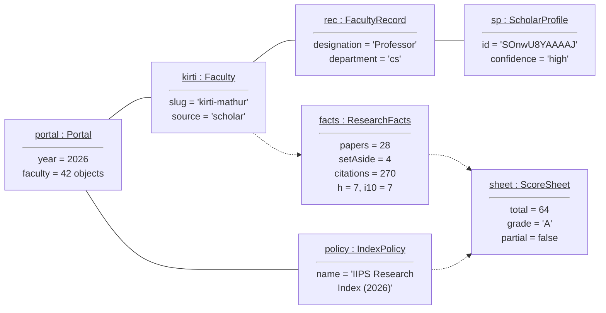

Values are real (snapshot of 2 Oct 2026): rank 3 of 26 graded faculty.

### 6.5 Sequence Diagram — building and viewing a profile

`portal : Portal`, `policy : IndexPolicy`, `load()` of `/faculty/[slug]`; Host = GitHub Pages / Vercel.

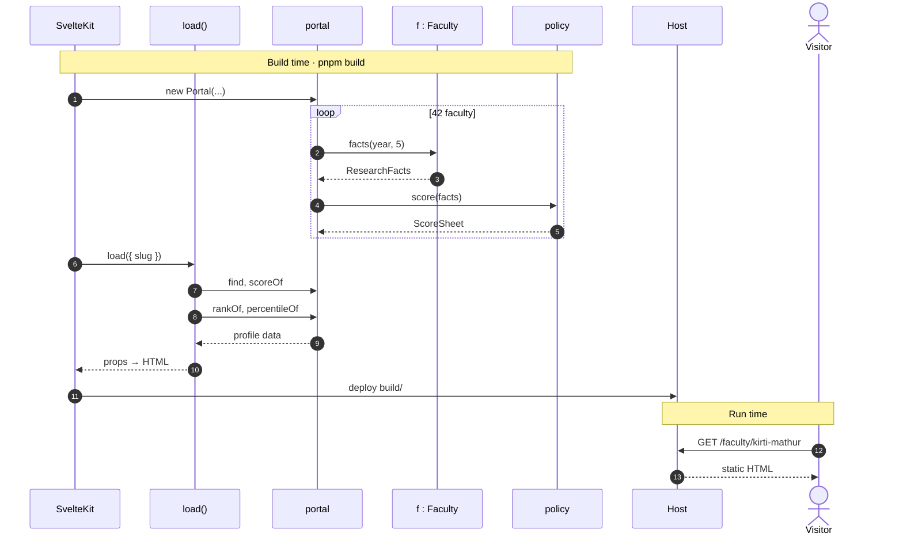

### 6.6 Communication Diagram — same interaction, object view

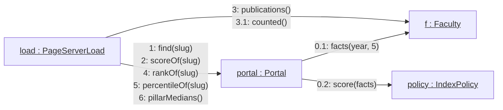

Messages `0.x` run once per faculty in the `Portal` constructor; `1–6` run for each profile page.

### 6.7 State Machine Diagram — a faculty member's data link

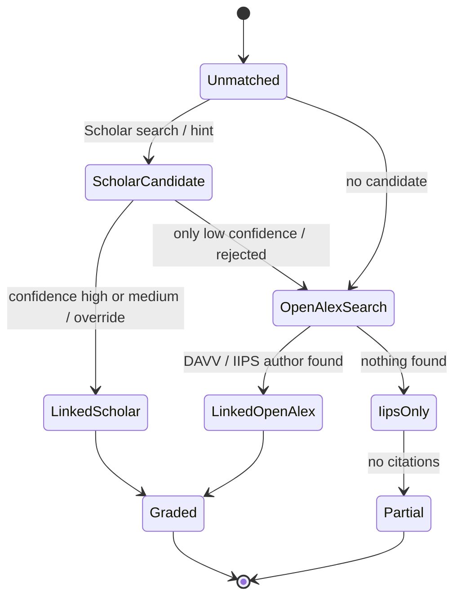

Snapshot: 19 linked to Scholar, 7 to OpenAlex, 16 IIPS-only (partial, no grade).

### 6.8 Package Diagram

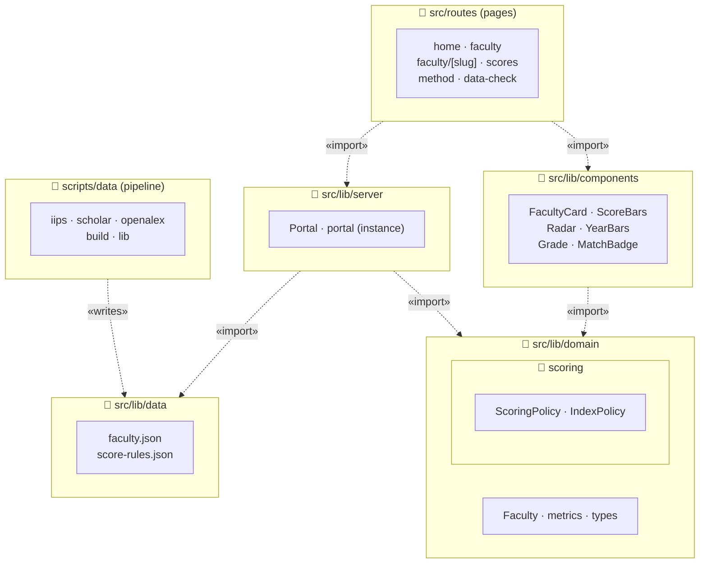

### 6.9 Component Diagram

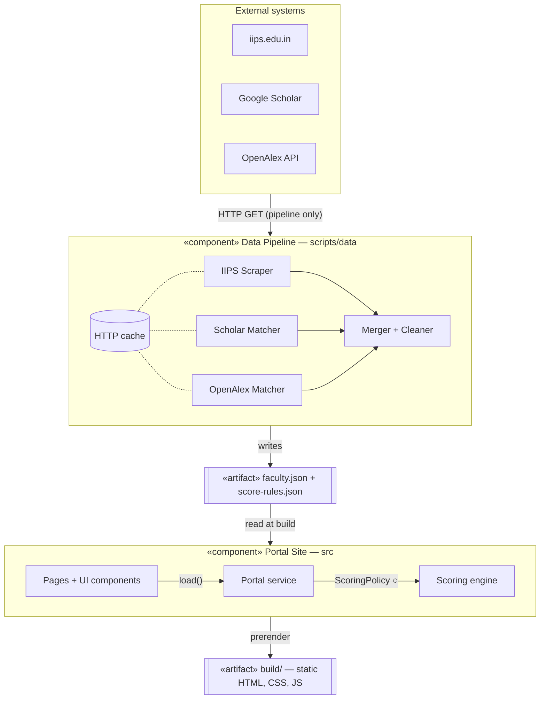

### 6.10 Deployment Diagram

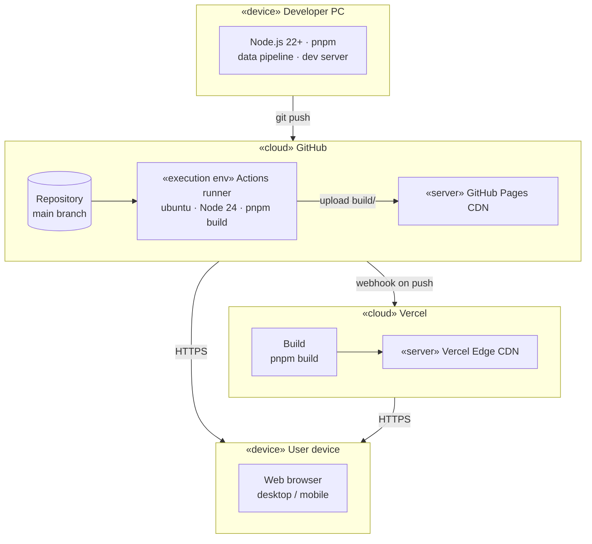

## 7. Database Design

> **No database server is used, by design.** The data is a single JSON snapshot read at build time (free hosting, nothing to run or secure). Below is the **logical** ER model of that JSON and the relational schema it would map to if moved to an RDBMS.

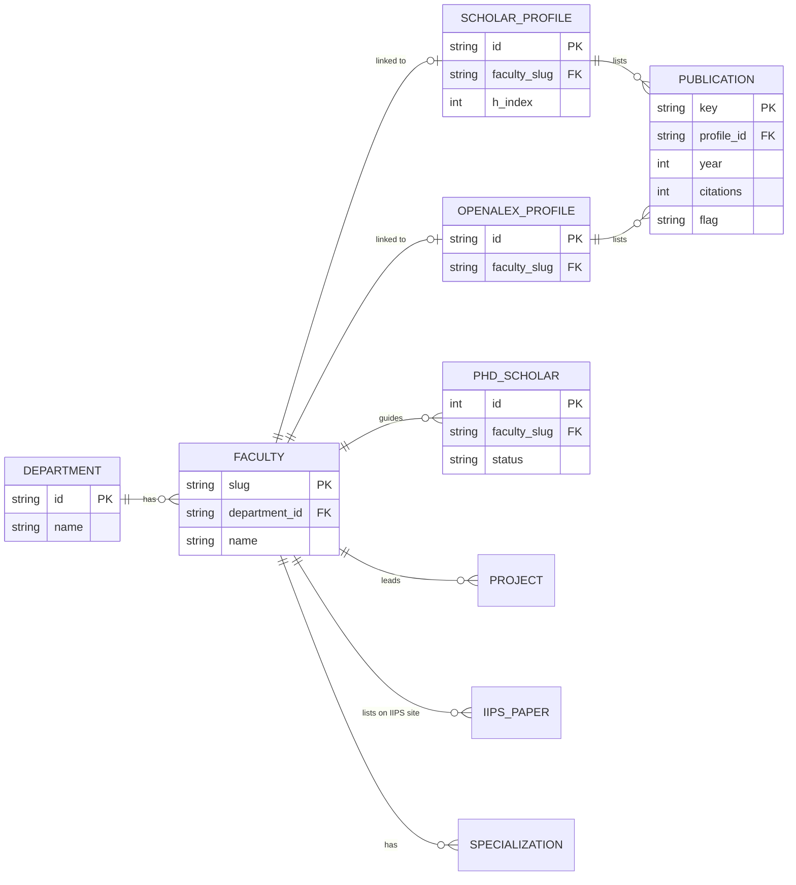

### Relational schema

PK in **bold**, FK in _italics_. The ER diagram shows keys and main fields only; full columns are here.

| Table            | Columns                                                                                                 |
| ---------------- | ------------------------------------------------------------------------------------------------------- |
| department       | **id**, name, short                                                                                     |
| faculty          | **slug**, iips_id, _department_id_, name, designation, qualification, teaching_years, photo, sort_order |
| specialization   | **_faculty_slug_, area**                                                                                |
| scholar_profile  | **id**, _faculty_slug_ (unique), confidence, decided_by, citations, h_index, i10_index                  |
| openalex_profile | **id**, _faculty_slug_ (unique), orcid, confidence                                                      |
| publication      | **key**, _profile_id_, source, title, authors, venue, year, citations, type, flag, doi                  |
| phd_scholar      | **id**, _faculty_slug_, name, topic, status (awarded / submitted / ongoing)                             |
| project          | **id**, _faculty_slug_, title, agency, status                                                           |
| iips_paper       | **id**, _faculty_slug_, text, link                                                                      |

Score rules are configuration (`score-rules.json`), not data, so they are kept out of the schema.

## 8. UI Mockups / Wireframes

**Inspiration:** the visual style follows the **IIPS-CoMET 2027** conference site, [iips.edu.in/comet27](https://iips.edu.in/comet27/): navy and IEEE blue, amber call-to-action buttons, small uppercase labels above headings, IIPS + DAVV logos in the header. Amber was darkened so white text on it passes WCAG AA.

> Separate low-fidelity wireframes were **not drawn** (time). The layout was built straight in code from the CoMET style, so the screenshots of the working prototype below serve as the high-fidelity mockups.

| Home                                  | Faculty profile                          |
| ------------------------------------- | ---------------------------------------- |
|     |  |
| **Faculty directory**                 | **Research score rankings**              |
| 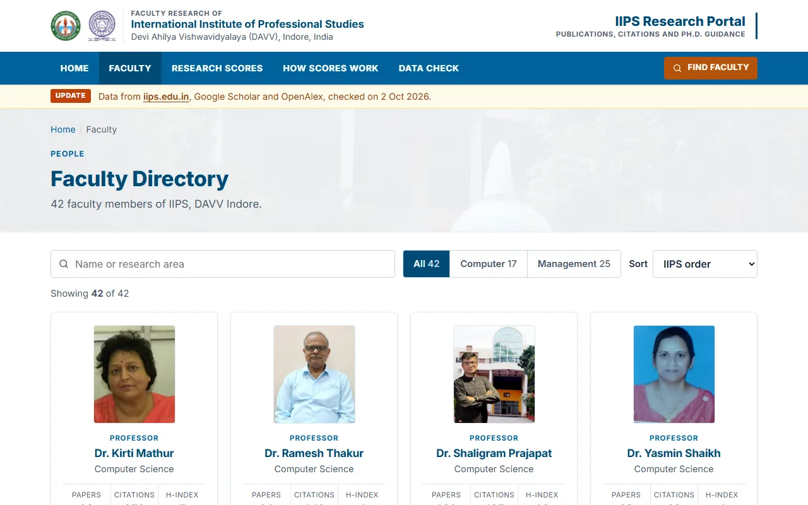 |       |

## 9. Layered Architecture

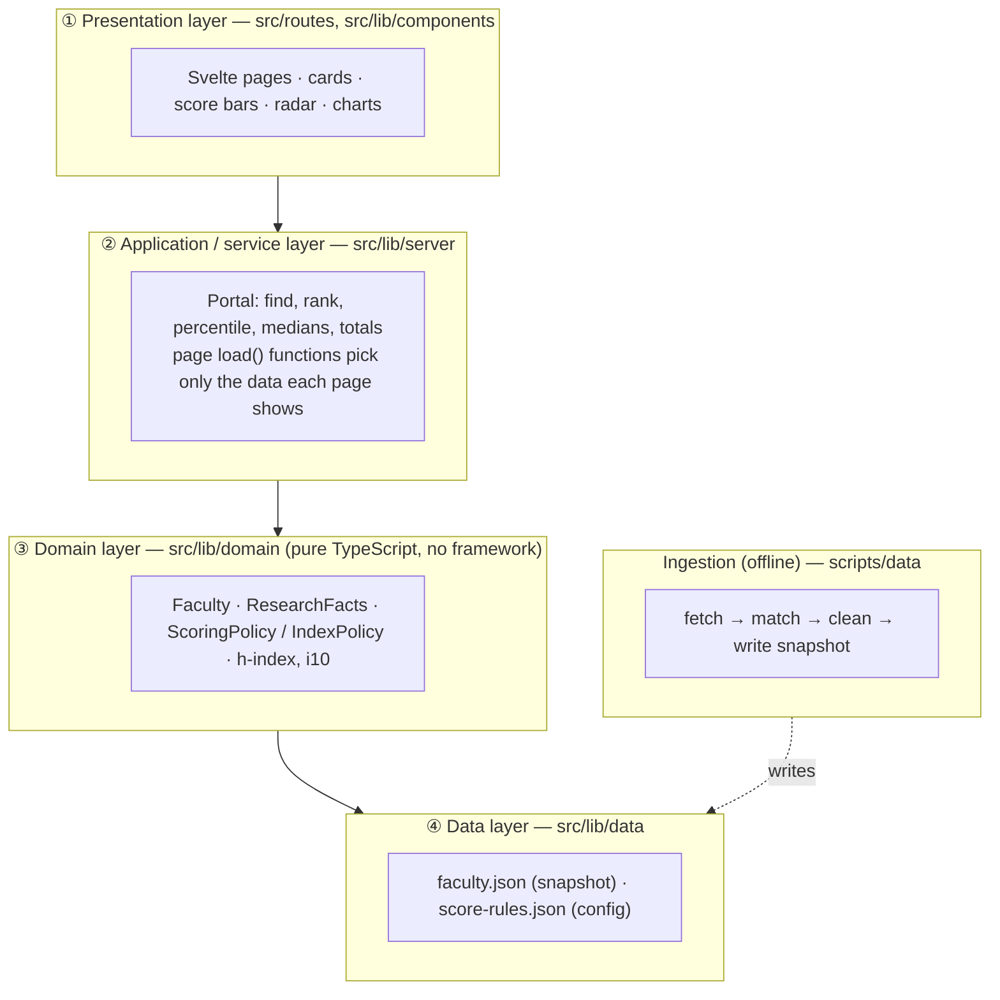

**Rule:** each layer only calls the one below. The domain layer has no imports from SvelteKit, so scoring is unit-tested on its own.

## 10. Design Patterns

| Pattern                       | Where                                             | Why it helps                                                                                                             |
| ----------------------------- | ------------------------------------------------- | ------------------------------------------------------------------------------------------------------------------------ |
| **Strategy**                  | `ScoringPolicy` interface ← `IndexPolicy`         | Swap or add a scoring rule set (e.g. an official API score) without touching pages.                                      |
| **Repository + Facade**       | `Portal`                                          | Pages ask one object for ranks, scores and papers; JSON details stay hidden.                                             |
| **Singleton**                 | `portal` instance in `src/lib/server/index.ts`    | Snapshot is loaded and scored once per build, shared by every page.                                                      |
| **Adapter / wrapper**         | `Faculty` wraps `FacultyRecord`                   | Three sources (Scholar, OpenAlex, IIPS) look the same to the rest of the code via `source`, `publications()`, `facts()`. |
| **Pipes and Filters**         | `scripts/data`: iips → scholar → openalex → build | Each step reads the previous output file; any step can be rerun alone.                                                   |
| **Cache-Aside**               | `cachedFetch()` in `scripts/data/lib.ts`          | Never hits a site twice; survives Scholar rate limits.                                                                   |
| **Data-driven configuration** | `score-rules.json`                                | Weights, targets and grades change without code changes.                                                                 |

## 11. Software Design Document (SDD)

| Area                 | Design decision                                                                                                                                                                      |
| -------------------- | ------------------------------------------------------------------------------------------------------------------------------------------------------------------------------------ |
| **Architecture**     | Static site generation: all pages prerendered from one snapshot (§9). No runtime server.                                                                                             |
| **Data flow**        | Pipeline (§6.2) → `faculty.json` → `Portal` → pages → static HTML (§6.9).                                                                                                            |
| **Profile matching** | Scholar candidates get evidence points (name fit, IIPS / DAVV affiliation, email domain, shared papers, Ph.D. co-authors) → high / medium / low. Manual `hints` and `overrides` win. |
| **Cleaning rules**   | A paper is set aside if: before-career, not-author, duplicate, manual, other-field, unconfirmed.                                                                                     |
| **Research Index**   | 5 pillars × 20 = 100: **Output**, **Impact**, **Quality**, **Recent work** (5 yrs), **Mentoring**.                                                                                   |
| **Score curve**      | `points = max × min(1, √(value ÷ target))`. Reaching ¼ of the target already gives ½ the points.                                                                                     |
| **Paper weights**    | journal 1 · book 2 · patent 2 · conference / chapter / other 0.5 · thesis 0. Ongoing Ph.D. = 0.5 of awarded.                                                                         |
| **Grades**           | A+ ≥ 75 · A ≥ 60 · B+ ≥ 45 · B ≥ 30 · C ≥ 15 · D. IIPS-only records: score shown, **no grade**.                                                                                      |
| **Ranking**          | Graded first, by total, then citations, then IIPS seniority order.                                                                                                                   |
| **Error handling**   | Unknown slug → 404 page; missing source → partial record with a visible note.                                                                                                        |
| **Testing**          | Vitest unit tests for scoring, cleaning, data integrity; Playwright e2e + axe accessibility.                                                                                         |
| **Deployment**       | GitHub Actions → GitHub Pages, and Vercel; both on every push to `main` (§6.10).                                                                                                     |

## 12. Prototype, GitHub & Documentation

| Item           | Link / command                                                                                                                                         |
| -------------- | ------------------------------------------------------------------------------------------------------------------------------------------------------ |
| Live prototype | [arpanpatra111.github.io/IIPS-Research](https://arpanpatra111.github.io/IIPS-Research/) · [iips-research.vercel.app](https://iips-research.vercel.app) |
| Repository     | [github.com/ARPANPATRA111/IIPS-Research](https://github.com/ARPANPATRA111/IIPS-Research)                                                               |
| Run locally    | `pnpm install` → `pnpm dev` → http://localhost:5173                                                                                                    |
| Quality checks | `pnpm check` · `pnpm lint` · `pnpm test` · `pnpm test:e2e`                                                                                             |
| Refresh data   | `pnpm data` (needs network) or `pnpm data:build` (offline, from saved fetches)                                                                         |
| Documentation  | `README.md` (setup, deploy, data, layout, limits) + this report + the `/method` page                                                                   |

## 13. Not Done, and Why

| Item                                           | Status                                 | Reason                                                                                                                          |
| ---------------------------------------------- | -------------------------------------- | ------------------------------------------------------------------------------------------------------------------------------- |
| Login, roles, faculty self-editing, admin CRUD | Not built      | Needs a backend and database; out of time. Corrections go through `overrides` / `exclusions` JSON + rebuild.                    |
| Live / real-time data                          | Not possible   | Google Scholar has no public API and blocks frequent automated requests. A dated snapshot is used.                              |
| Official UGC **API score** / PBAS              | Replaced     | Official scoring needs self-appraisal forms and proof documents that are not public. A transparent local index is used instead. |
| Patent tracking                                | Partial      | Only 2 patents found: Scholar / OpenAlex rarely list patents and there is no public IIPS patent feed.                           |
| Citations for 16 faculty                       | Partial      | No Scholar or OpenAlex profile could be confirmed; shown as partial, never graded against others.                               |
| Relational database                            | Logical only | Not needed for a read-only static site; ER + schema given in §7.                                                                |
| Low-fidelity wireframes                        | Skipped      | Time; layout built directly from the CoMET reference, screenshots used as mockups (§8).                                         |
